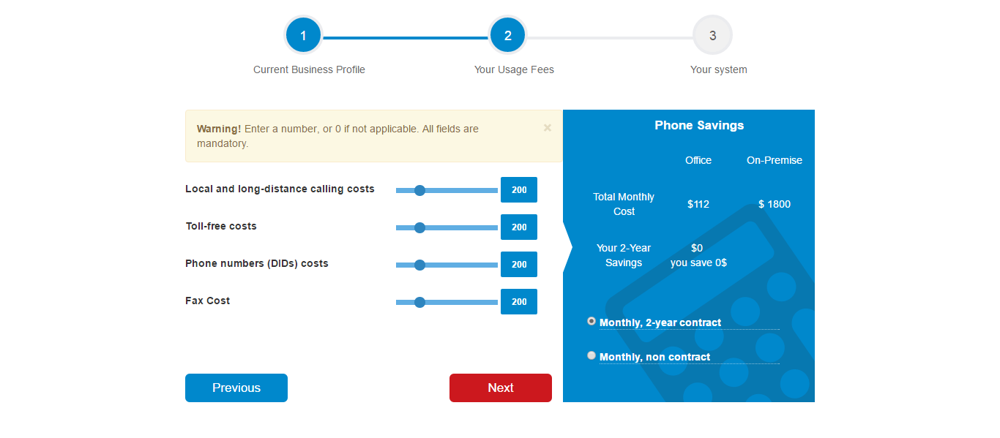

RIO Calculator (Mini exercise project)
======
This is a mini exercise file for a **cloud-based global communication Provider** that calculate, compare and at end show how much the businesses can save compared to the cost of an on-premise PBX.

The Idea of this project is for the need of one of my fiend of this multi step calculator for his bussiness, and i will try to implement it by JQuery.

You can see the preview in [Github](http://htmlpreview.github.io/?https://github.com/soori8/RIO-Calculator/blob/master/index.html) and also the preview image is below:

some Feature of this project:
- use Bootstrap framework as its Grid system to be responsive
- use Jquery to validate the user input and also to calculate the prices based on the variables
- also i tried to use JQuery for creating a multiStep form for showing each fielset in seperate page

I will be happy to hear from you in order to improve the functionality or implement it in a better way.
